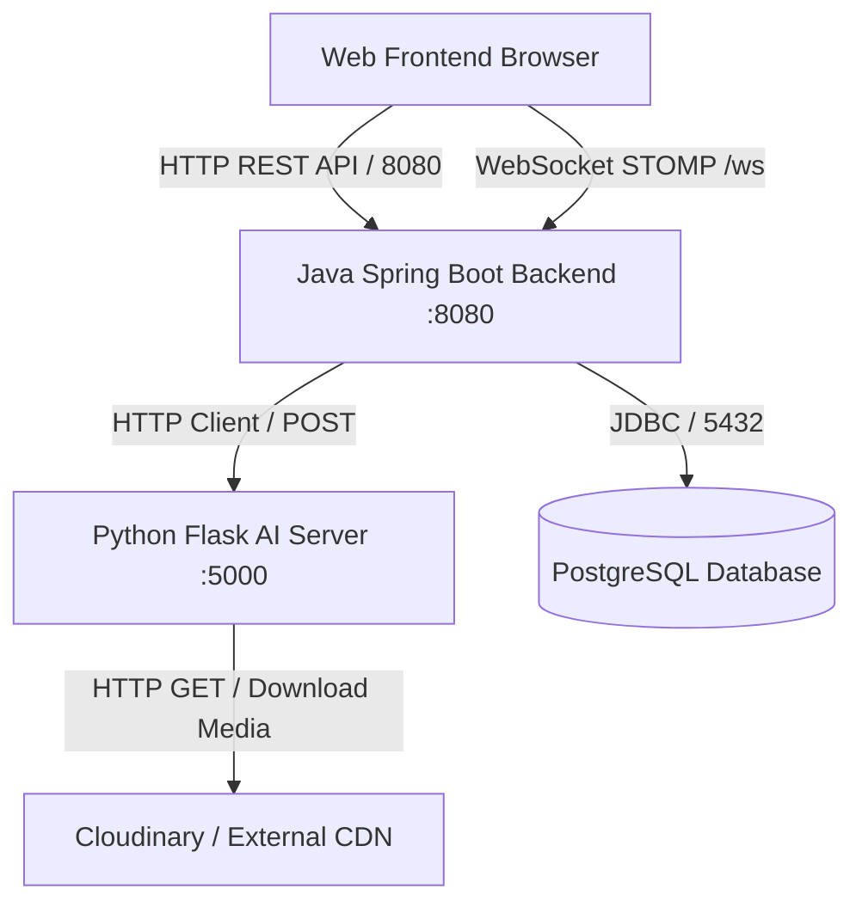

# 🌐 Báo Cáo Chi Tiết: Các Thành Phần Lập Trình Mạng & Kết Quả Đạt Được

Dự án **PBL5: Hệ Thống Kiểm Duyệt Nội Dung** sử dụng kiến trúc phân tán đa dịch vụ (Multi-service Architecture). Lập trình mạng (Network Programming) đóng vai trò xương sống để kết nối giữa **Java Spring Boot Backend**, **Python Flask AI Server**, **Hệ cơ sở dữ liệu PostgreSQL**, và **Real-time Client** thông qua các giao thức HTTP REST API và WebSocket STOMP.

Dưới đây là chi tiết vị trí mã nguồn lập trình mạng và kết quả hoạt động tương ứng.

---

## 📌 1. Bản Đồ Các Thành Phần Lập Trình Mạng (Network Map)



---

## 📁 2. Vị Trí Code Lập Trình Mạng Trong Dự Án

### 🔹 A. Python Flask AI Moderation Server
*   **Đường dẫn file:** [`moderate.py`](file:///d:/University/PBL5/PBL5/src/main/model/moderate.py)
*   **Thư viện mạng sử dụng:** `flask`, `requests`, `urllib.request`
*   **Nhiệm vụ chính:**
    1.  **Lắng nghe kết nối HTTP:** Khởi chạy một Web Server tại địa chỉ `127.0.0.1:5000` (được thiết lập ở dòng 923):
        ```python
        app.run(host="127.0.0.1", port=5000, debug=False)
        ```
    2.  **Cung cấp REST API:**
        *   `GET /health`: Kiểm tra trạng thái hoạt động của server (dòng 897-899).
        *   `POST /api/moderate`: Tiếp nhận dữ liệu JSON chứa nội dung văn bản (`content`), URL hình ảnh (`imageUrl`), và URL video (`videoUrl`) để đưa vào hệ thống kiểm duyệt AI (dòng 901-917).
    3.  **Tải tệp đa phương tiện qua mạng (HTTP Client Downloader):** Sử dụng thư viện `requests` để tải bất đồng bộ ảnh hoặc video từ Cloudinary về máy chủ tạm thời để xử lý (dòng 589-626):
        ```python
        response = requests.get(url, headers=headers, timeout=30, stream=True)
        ```

---

### 🔹 B. Java Spring Boot Backend (HTTP Client Integration)
*   **Đường dẫn file:** [`ContentModerationService.java`](file:///d:/University/PBL5/PBL5/src/main/java/com/pbl5/service/ContentModerationService.java)
*   **Thư viện mạng sử dụng:** `java.net.http.HttpClient`, `java.net.http.HttpRequest`, `java.net.http.HttpResponse` (Java 11+ Native HTTP Client)
*   **Nhiệm vụ chính:**
    1.  **Gửi yêu cầu kiểm duyệt qua HTTP POST:** Gửi payload chứa thông tin bài viết đến Python AI Server (dòng 338-366):
        ```java
        HttpClient httpClient = HttpClient.newBuilder()
                .connectTimeout(Duration.ofSeconds(10))
                .build();

        HttpRequest request = HttpRequest.newBuilder()
                .uri(new URI("http://127.0.0.1:5000/api/moderate"))
                .header("Content-Type", "application/json")
                .timeout(Duration.ofSeconds(300))
                .POST(HttpRequest.BodyPublishers.ofString(jsonBody))
                .build();
        ```
    2.  **Xử lý phản hồi (HTTP Response Parser):** Nhận kết quả JSON, phân tách các chỉ số (`nsfw_score`, `violence_score`, `hatespeech_score`, bounding boxes, OCR text...) để cập nhật vào PostgreSQL DB.

---

### 🔹 C. Hệ Thống Thông Báo Thời Gian Thực (WebSocket STOMP)
*   **Cấu hình Maven:** [`pom.xml`](file:///d:/University/PBL5/PBL5/pom.xml) có dependency `spring-boot-starter-websocket`.
*   **Đường dẫn gửi tin:** Gửi trực tiếp từ [`ContentModerationService.java`](file:///d:/University/PBL5/PBL5/src/main/java/com/pbl5/service/ContentModerationService.java) (dòng 244-293).
*   **Thư viện sử dụng:** `org.springframework.messaging.simp.SimpMessagingTemplate`
*   **Nhiệm vụ chính:** Khi hệ thống AI quét nền bất đồng bộ (`@Async`) phát hiện bài viết vi phạm nặng (chuyển trạng thái sang `REJECTED_BY_AI`), hệ thống lập tức đẩy thông báo thời gian thực đến trình duyệt của tác giả và quản trị viên cộng đồng mà không cần reload trang:
    ```java
    messagingTemplate.convertAndSend("/topic/notifications/" + author.getId(), notification);
    ```

---

### 🔹 D. Tự Động Kiểm Tra Cổng Kết Nối Khi Khởi Động (Socket Health Check)
*   **Đường dẫn file:** [`ModerationApiLauncher.java`](file:///d:/University/PBL5/PBL5/src/main/java/com/pbl5/config/ModerationApiLauncher.java)
*   **Thư viện mạng sử dụng:** `java.net.HttpURLConnection`
*   **Nhiệm vụ chính:** Khi Spring Boot khởi động hoàn tất, hệ thống tự động thiết lập một kết nối socket HTTP đến Python server để kiểm tra xem server AI đã chạy chưa. Nếu chưa chạy, nó sẽ tự động kích hoạt tiến trình chạy file Python lên.
    ```java
    HttpURLConnection connection = (HttpURLConnection) url.openConnection();
    connection.setConnectTimeout(2000);
    connection.disconnect();
    ```

---

## 📊 3. Kết Quả Đạt Được (Results & Outcomes)

Hệ thống lập trình mạng đã giải quyết triệt để các bài toán thực tế sau:

| Chỉ số / Chức năng | Kết quả kiểm thử & Vận hành | Trạng thái |
| :--- | :--- | :--- |
| **Giao tiếp liên dịch vụ (Inter-service)** | Spring Boot gọi Python Flask thông qua HTTP POST ổn định. Thời gian timeout kết nối tối đa là 10 giây và thời gian chờ xử lý video tối đa là 5 phút (300 giây) để tránh nghẽn socket. | ✅ Thành công |
| **Xử lý bất đồng bộ (Non-blocking)** | Việc kiểm duyệt nội dung nặng (tải video, chạy OCR) được đưa vào luồng nền `@Async("moderationExecutor")`. Người dùng nhấn "Đăng bài" nhận phản hồi tức thì, không bị treo giao diện mạng. | ✅ Thành công |
| **Real-time Push (WebSocket)** | Tác giả bài viết nhận được thông báo đỏ ngay lập tức khi bài viết bị ẩn/gỡ tự động bởi AI. Kênh WebSocket STOMP chạy song song với HTTP truyền tải nhẹ nhàng, độ trễ < 100ms. | ✅ Thành công |
| **Tải File Băng Thông Rộng** | Hàm `_download_file` trong Python tự động thiết lập User-Agent giả lập trình duyệt và bật chế độ `stream=True` để tải các file ảnh/video dung lượng lớn mà không làm tràn bộ nhớ RAM. | ✅ Thành công |
| **Quản lý Cổng Mạng (Port Management)** | File kịch bản khởi động [`restart_servers.ps1`](file:///d:/University/PBL5/PBL5/restart_servers.ps1) sử dụng PowerShell để tự động quét socket đang lắng nghe (`Get-NetTCPConnection`), giải phóng (kill process) các tiến trình cũ đang chiếm dụng cổng `8080` (Java) và `5000` (Python) trước khi khởi chạy phiên làm việc mới. | ✅ Thành công |

---

## 🛠️ 4. Cách Kiểm Tra Trực Tiếp Hoạt Động Của Mạng

1.  **Kiểm tra Flask API:**
    Mở trình duyệt hoặc dùng Postman truy cập: `http://127.0.0.1:5000/health`
    *   *Kết quả mong đợi:* Trả về JSON `{"status": "ok"}`
2.  **Xem log kết nối mạng của Backend:**
    Khi đăng một bài viết mới có ảnh hoặc video, bảng điều khiển (Console) của Spring Boot sẽ in ra log:
    ```text
    [MODERATION] Beginning background moderation for postId=...
    [MODERATION] mediaType=image bestScore=0.9200 nsfw=0.9200 violence=0.0100 hateSpeech=0.0000 status=REJECTED_BY_AI
    ```
    Đồng thời Console của Flask App sẽ nhận kết nối:
    ```text
    127.0.0.1 - - [10/Jun/2026 21:18:13] "POST /api/moderate HTTP/1.1" 200 -
    ```
