# 🧬 Báo Cáo Phân Tích Toàn Diện: Tính Kế Thừa (Inheritance) Trong OOP Của Dự Án (Cập Nhật Chi Tiết)

Tính kế thừa (**Inheritance**) là một trong bốn cột trụ chính của Lập trình hướng đối tượng (OOP). Nó cho phép các thực thể thừa hưởng và tái sử dụng lại các thuộc tính, phương thức từ lớp cha (Superclass) để giảm thiểu mã nguồn dư thừa, tăng tính nhất quán và dễ dàng bảo trì.

Dự án **PBL5: Hệ Thống Kiểm Duyệt Nội Dung** áp dụng tính kế thừa đa chiều (Class Inheritance, Interface Inheritance, và Framework Extension Inheritance) cực kỳ sâu sắc trên toàn bộ codebase.

---

## 📊 1. Bản Đồ Phân Cấp Kế Thừa Toàn Hệ Thống

Sơ đồ dưới đây minh họa toàn bộ các nhánh kế thừa trong dự án của bạn từ tầng Mô hình dữ liệu, Bảo mật, Kho lưu trữ cho tới hệ thống Trí tuệ nhân tạo:

```mermaid
classDiagram
    %% Tầng Dữ liệu (Models)
    class BaseContent {
        <<Abstract>>
        - Long id
        - LocalDateTime createdAt
        # onCreate() void
    }
    class Post {
        - String content
        - PostStatus status
    }
    class Comment {
        - String content
        - Post post
    }
    BaseContent <|-- Post : Thực thể hóa Bài viết
    BaseContent <|-- Comment : Thực thể hóa Bình luận

    %% Tầng Bảo mật (Spring Security Extension)
    class OncePerRequestFilter {
        <<Framework Class>>
        # doFilterInternal()
    }
    class JwtAuthenticationFilter {
        - JwtTokenProvider jwtTokenProvider
        # doFilterInternal()
    }
    OncePerRequestFilter <|-- JwtAuthenticationFilter : Kế thừa bộ lọc request duy nhất

    class DefaultOAuth2UserService {
        <<Framework Class>>
        + loadUser()
    }
    class CustomOAuth2UserService {
        - UserRepository userRepository
        + loadUser()
    }
    DefaultOAuth2UserService <|-- CustomOAuth2UserService : Kế thừa luồng nạp user từ Google

    class SimpleUrlAuthenticationSuccessHandler {
        <<Framework Class>>
        + onAuthenticationSuccess()
    }
    class OAuth2AuthenticationSuccessHandler {
        - JwtTokenProvider tokenProvider
        + onAuthenticationSuccess()
    }
    SimpleUrlAuthenticationSuccessHandler <|-- OAuth2AuthenticationSuccessHandler : Kế thừa xử lý chuyển hướng thành công

    class UserDetails {
        <<Interface>>
        + getAuthorities()
        + getPassword()
        + isEnabled()
    }
    class CustomUserDetails {
        - User user
        + getAuthorities()
    }
    UserDetails <|.. CustomUserDetails : Hiện thực hóa Hợp đồng User

    %% Tầng Repositories
    class JpaRepository~T, ID~ {
        <<Interface>>
    }
    class PostRepository {
        <<Interface>>
    }
    JpaRepository <|-- PostRepository : Kế thừa CRUD & Phân trang

    %% Tầng Python Machine Learning
    class nn_Module {
        <<PyTorch Class>>
        + to(device)
        + eval()
    }
    class NSFWModel {
        + forward(x)
    }
    nn_Module <|-- NSFWModel : Kế thừa chuyển thiết bị xử lý
```



---

## 🔍 2. Phân Tích Chi Tiết 5 Nhóm Kế Thừa Trong Dự Án

### 🔹 Nhóm 1: Kế Thừa Thực Thể Cơ Sở Dữ Liệu (JPA Entity Inheritance)
Được triển khai tại [`BaseContent.java`](file:///d:/University/PBL5/PBL5/src/main/java/com/pbl5/model/BaseContent.java):
*   **Lớp cha (Superclass):** `BaseContent` được gắn thẻ `@MappedSuperclass`, là lớp cha trừu tượng của toàn bộ nội dung do người dùng tự tạo.
*   **Lớp con (Subclasses):** [`Post.java`](file:///d:/University/PBL5/PBL5/src/main/java/com/pbl5/model/Post.java) và [`Comment.java`](file:///d:/University/PBL5/PBL5/src/main/java/com/pbl5/model/Comment.java) sử dụng từ khóa `extends BaseContent`.
*   **Chi tiết hoạt động:**
    *   **Tái sử dụng thuộc tính:** Cả `Post` và `Comment` thừa hưởng trường khóa chính `id` và ngày khởi tạo `createdAt` mà không cần viết lại mã nguồn.
    *   **Kế thừa hành vi vòng đời:** Phương thức `@PrePersist protected void onCreate()` của `BaseContent` tự động kích hoạt gán `createdAt = LocalDateTime.now()` trước khi đối tượng được ghi xuống DB, áp dụng cho cả thực thể `Post` và `Comment`.

---

### 🔹 Nhóm 2: Kế Thừa Bộ Lọc Và Luồng Xử Lý Bảo Mật (Spring Security Framework Extension)
Dự án sử dụng cơ chế kế thừa để ghi đè (override) và mở rộng (extend) hành vi bảo mật mặc định của Spring Security:

1.  **Đóng gói vòng đời lọc mạng (`JwtAuthenticationFilter`):**
    *   **Kế thừa:** `public class JwtAuthenticationFilter extends OncePerRequestFilter` (tại [`JwtAuthenticationFilter.java`](file:///d:/University/PBL5/PBL5/src/main/java/com/pbl5/security/JwtAuthenticationFilter.java)).
    *   **Chi tiết:** `OncePerRequestFilter` (lớp cha từ Spring Web) bảo đảm bộ lọc này chỉ thực thi chính xác **một lần duy nhất** cho mỗi yêu cầu HTTP. Bằng cách kế thừa, `JwtAuthenticationFilter` chỉ cần tập trung ghi đè phương thức `doFilterInternal(...)` để bóc tách mã JWT từ header mà không cần quan tâm đến cách thức quản lý luồng Servlet hay ngăn chặn việc lặp lại filter.
2.  **Đăng nhập Google OAuth2 (`CustomOAuth2UserService`):**
    *   **Kế thừa:** `public class CustomOAuth2UserService extends DefaultOAuth2UserService` (tại [`CustomOAuth2UserService.java`](file:///d:/University/PBL5/PBL5/src/main/java/com/pbl5/security/CustomOAuth2UserService.java)).
    *   **Chi tiết:** Bằng việc kế thừa `DefaultOAuth2UserService`, lớp con giữ nguyên toàn bộ giao tiếp mạng chuẩn hóa với Google API qua hàm `super.loadUser(userRequest)`. Lớp con sau đó chèn thêm logic nghiệp vụ tùy chỉnh (lưu thông tin user mới vào DB với trạng thái `ACTIVE` mà không cần verify email) một cách mượt mà.
3.  **Điều hướng thành công OAuth2 (`OAuth2AuthenticationSuccessHandler`):**
    *   **Kế thừa:** `public class OAuth2AuthenticationSuccessHandler extends SimpleUrlAuthenticationSuccessHandler` (tại [`OAuth2AuthenticationSuccessHandler.java`](file:///d:/University/PBL5/PBL5/src/main/java/com/pbl5/security/OAuth2AuthenticationSuccessHandler.java)).
    *   **Chi tiết:** Kế thừa khả năng xử lý chuyển hướng của `SimpleUrlAuthenticationSuccessHandler`. Lớp con ghi đè phương thức `onAuthenticationSuccess` để tạo mã JWT, lưu lịch sử đăng nhập (`LoginHistory`) và dùng cơ chế redirect có sẵn của cha `getRedirectStrategy().sendRedirect(...)` chuyển hướng người dùng về trang chủ kèm theo token.

---

### 🔹 Nhóm 3: Hiện Thực Hợp Đồng Bảo Mật (Interface Implementation Inheritance)
Bên cạnh kế thừa lớp, dự án sử dụng kế thừa giao diện để biến thực thể của hệ thống tương thích với các tiêu chuẩn quốc tế:

*   **Hiện thực hóa:** `public class CustomUserDetails implements UserDetails` (tại [`CustomUserDetails.java`](file:///d:/University/PBL5/PBL5/src/main/java/com/pbl5/security/CustomUserDetails.java)).
*   **Chi tiết:** `UserDetails` là giao diện (Interface) tiêu chuẩn của Spring Security. `CustomUserDetails` đóng vai trò là một lớp bao bọc lấy thực thể `User` trong DB của bạn và triển khai các hàm bắt buộc (`getAuthorities()`, `getPassword()`, `getUsername()`, `isAccountNonLocked()`). Điều này cho phép Spring Security có thể kiểm tra phân quyền, thời hạn khóa tài khoản một cách đa hình mà không cần biết cấu trúc DB thực tế của bạn như thế nào.

---

### 🔹 Nhóm 4: Kế Thừa Giao Diện Truy Xuất Dữ Liệu (Spring Data Interface Hierarchy)
*   **Kế thừa:** `public interface PostRepository extends JpaRepository<Post, Long>` (tại [`PostRepository.java`](file:///d:/University/PBL5/PBL5/src/main/java/com/pbl5/repository/PostRepository.java)).
*   **Chi tiết:** `PostRepository` là một Interface kế thừa lại Interface `JpaRepository` của Spring Boot. Theo quy tắc đa thừa kế của Interface trong Java, lớp Repository con của bạn tự động có sẵn hàng chục hàm truy vấn chuẩn hóa (`save`, `delete`, `findAll`, `existsById`). Ngoài ra, nó cũng kế thừa cơ chế tự động sinh câu lệnh SQL từ tên phương thức của Spring Data (ví dụ: `findByUserIdAndStatusOrderByCreatedAtDesc`).

---

### 🔹 Nhóm 5: Kế Thừa Khả Năng Tính Toán Của Thư Viện AI (Python PyTorch Class Inheritance)
Tại tệp Python [`moderate.py`](file:///d:/University/PBL5/PBL5/src/main/model/moderate.py):
*   **Kế thừa:** Các mô hình mạng nơ-ron như `NSFWModel`, `ViolenceModel`, `MfccHatespeechModel` đều kế thừa từ lớp cơ sở của thư viện PyTorch:
    ```python
    class NSFWModel(nn.Module):
        def __init__(self):
            super().__init__() # Gọi constructor lớp cha nn.Module
    ```
*   **Chi tiết:** Nhờ kế thừa `nn.Module`, các mô hình con này tự động sở hữu cơ chế theo dõi tham số mạng nơ-ron, khả năng chuyển dịch giữa các thiết bị phần cứng CPU và GPU (`.to(device)`), và cơ chế lưu trữ trọng số huấn luyện (`load_state_dict`). Lập trình viên chỉ cần tập trung thiết kế kiến trúc các tầng kết nối (`forward`) mà không phải xây dựng lại thuật toán lan truyền ngược (backpropagation) từ đầu.

---

## 🏆 3. Những Ưu Điểm Đạt Được Nhờ Thiết Kế Kế Thừa Phân Tầng

1.  **Duy trì tính mở rộng dễ dàng (Open/Closed Principle):** Bằng cách kế thừa các bộ lọc bảo mật như `OncePerRequestFilter` hay `DefaultOAuth2UserService`, bạn có thể bổ sung các tầng kiểm tra, xác thực mới mà hoàn toàn không cần can thiệp hay chỉnh sửa mã nguồn cốt lõi của thư viện Spring Security.
2.  **Đồng bộ hóa hoạt động hệ thống (Consistency):** Nhờ lớp cha chung `BaseContent`, các cấu trúc bài đăng và bình luận luôn đồng bộ và tuân thủ chặt chẽ vòng đời của cơ sở dữ liệu.
3.  **Tập trung vào nghiệp vụ cốt lõi:** Kế thừa giúp giải phóng bạn khỏi việc viết các đoạn mã Boilerplate (mã boilerplate kết nối database JDBC, mã boilerplate cấu hình chuyển hướng URL, mã boilerplate tính toán đạo hàm mạng nơ-ron). Bạn chỉ cần ghi đè các hàm cần thiết để thực hiện nghiệp vụ của riêng mình.
